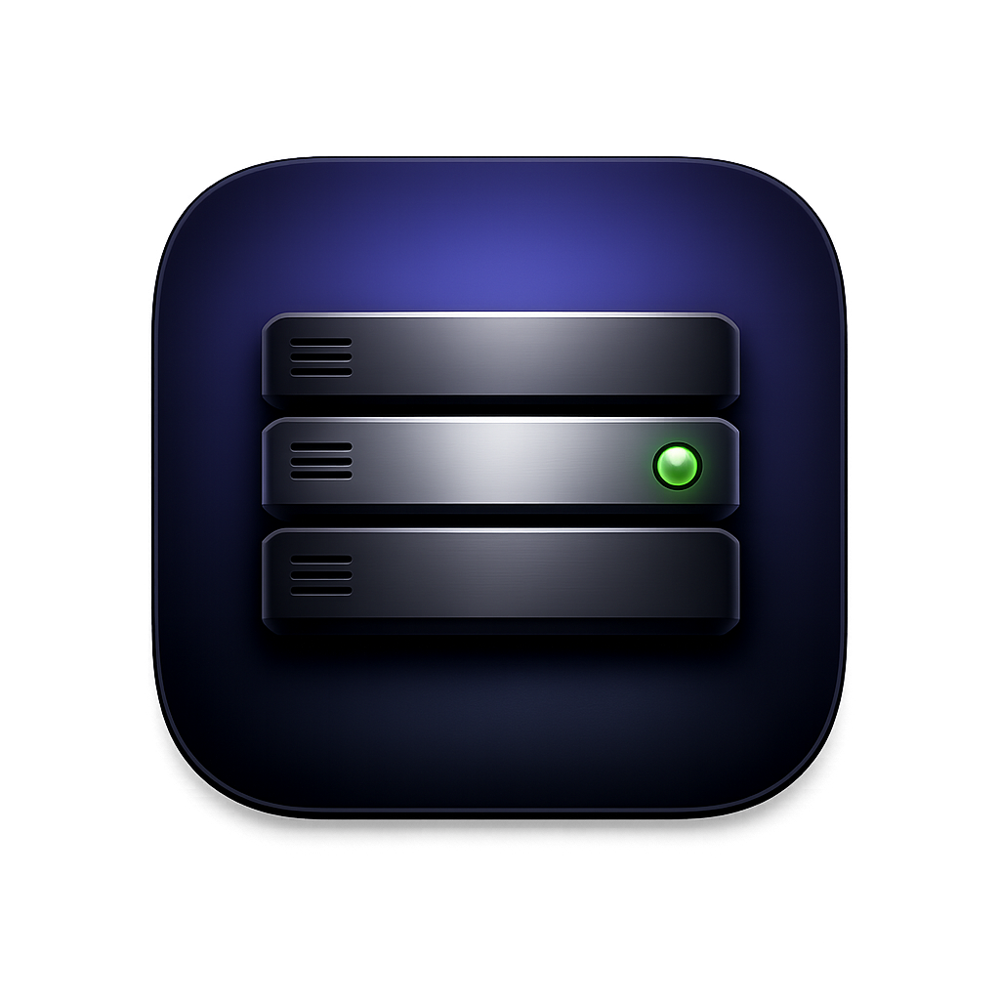

<div align="center">
  
  <h1>Hangar</h1>
  <p><strong>A menu bar app for running your local dev servers.</strong></p>
  <p>
    <a href="https://github.com/hsyvy/hangar/releases/latest">Download</a> ·
    <a href="#features">Features</a> ·
    <a href="#build-from-source">Build from source</a>
  </p>
</div>

---

Hangar keeps every local server — your web app, API, worker, docs site — in one window. Register a command once, then start, stop, and watch its logs without juggling terminal tabs. When a server is done, Hangar shuts down the whole process tree, so nothing is left squatting on port 3000.

<!-- TODO: add a screenshot here once you have one, e.g.  -->

## Features

- **One home for every server.** Register a name, working directory, shell command, and optional environment variables. Start and stop each one with a click.
- **Live logs.** stdout and stderr stream straight into the app, per server — no terminal tabs to hunt through.
- **Clean shutdown.** Stopping a server signals the entire process tree (`SIGTERM`, then `SIGKILL` after a short grace period). No orphaned `node` / `vite` / `python` processes holding your ports.
- **URL auto-detect.** Hangar watches log output for `http://localhost:PORT` and gives you a one-click button to open it in your browser.
- **Your real shell.** Commands run through a login shell (`zsh -ilc`), so `nvm`, `pyenv`, `asdf`, and your `PATH` resolve exactly like they do in Terminal.
- **Menu bar access.** See and toggle every server from the menu bar without opening the main window.
- **Status at a glance.** Stopped, Starting, Running, or Crashed (with exit code) — shown with a color-coded dot.
- **Liquid Glass UI.** Light, dark, or system appearance, with six pastel background tints.
- **Automatic updates.** Hangar checks for new releases with [Sparkle](https://sparkle-project.org) and installs them in place — no hunting for DMGs.

## Install

1. Download the latest `Hangar-x.y.z.dmg` from the [Releases page](https://github.com/hsyvy/hangar/releases/latest).
2. Open the DMG and drag **Hangar** into **Applications**.
3. Launch it. The app is signed with a Developer ID and notarized by Apple, so it opens with no Gatekeeper warnings.

Requires **macOS 14 (Sonoma)** or later.

After the first launch Hangar keeps itself up to date with [Sparkle](https://sparkle-project.org): it checks for new versions automatically (with your permission) and you can trigger a check anytime from **Hangar ▸ Check for Updates…** or **Settings ▸ About**.

## Build from source

Hangar uses [XcodeGen](https://github.com/yonaskolb/XcodeGen) to generate its Xcode project from `project.yml`.

```sh
brew install xcodegen      # one-time, if you don't have it
xcodegen generate          # regenerates Hangar.xcodeproj
open Hangar.xcodeproj      # build & run with ⌘R
```

To produce a signed, notarized DMG (requires a Developer ID Application certificate and a `notarytool` keychain profile):

```sh
./scripts/release.sh                 # full build → sign → notarize → DMG → appcast
./scripts/release.sh --skip-notarize # signed only, no notarization
```

The script also writes `dist/appcast.xml`, the Sparkle update feed. To ship a release:

1. Bump `CFBundleShortVersionString` **and** `CFBundleVersion` in `project.yml` — Sparkle detects updates by the integer `CFBundleVersion`, so it must increase every release.
2. Run `xcodegen generate` so the project picks up the new version.
3. Run `./scripts/release.sh` — it builds, signs, notarizes, and produces `Hangar-x.y.z.dmg` plus `appcast.xml` in `dist/`.
4. Create a GitHub release tagged `vx.y.z` and upload **both** files as assets — the script prints the exact `gh release create` command.

Signing the appcast needs the Sparkle EdDSA private key in your login keychain (created once with Sparkle's `generate_keys`); its public half is pinned as `SUPublicEDKey` in `project.yml`.

## How it works

Hangar is a native SwiftUI app whose only external dependency is [Sparkle](https://sparkle-project.org), which powers in-app updates. Each registered server gets a `ServerRunner` that launches the command as a child process, pipes its output into a log buffer, and tracks its lifecycle. There is no daemon and no background service — when you quit Hangar, every server it started is terminated with it.

## License

[MIT](LICENSE) © Himanshu Kumar
